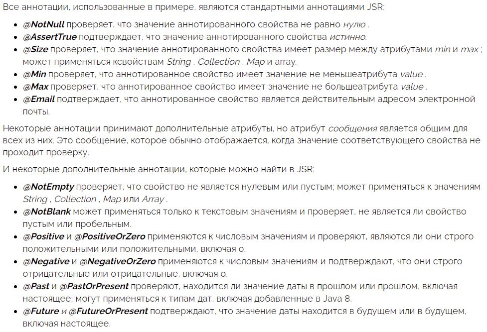

#Стандартные ограничения
Библиотека javax.validation имеет множество аннотаций для валидации.
###Каждая аннотация имеет следующие поля:
•	message — указывает на ключ свойства в ValidationMessages.properties, который используется для отправки сообщения в случае нарушения ограничения.
•	groups — позволяет определить, при каких обстоятельствах будет срабатывать эта проверка (о группах проверки поговорим позже).
•	payload — позволяет определить полезную нагрузку, которая будет передаваться сс проверкой.
•	@Constraint — указывает на реализацию интерфейса ConstraintValidator.
###Рассмотрим популярные ограничения.
####@NotNull и @Null
@NotNull — аннотированный элемент не должен быть null. Принимает любой тип.
@Null — аннотированный элемент должен быть null. Принимает любой тип.
####@NotBlank и @NotEmpty
@NotBlank — аннотированный элемент не должен быть null и должен содержать хотя бы один непробельный символ. Принимает CharSequence.
@NotEmpty — аннотированный элемент не должен быть null или пустым. Поддерживаемые типы:

•	CharSequence  
•	Collection. Оценивается размер коллекции  
•	Map. Оценивается размер мапы  
•	Array. Оценивается длина массива  

@NotBlank применяется только к строкам и проверяет, что строка не пуста и не состоит только из пробелов.

@NotNull применяется к CharSequence, Collection, Map или Array и проверяет, что объект не равен null. Но при этом он может быть пуст.

@NotEmpty применяется к CharSequence, Collection, Map или Array и проверяет, что он не null имеет размер больше 0.

Аннотация @Size(min=6) пропустит строку состоящую из 6 пробелов и/или символов переноса строки, а @NotBlank не пропустит.

####@Size
Размер аннотированного элемента должен быть между указанными границами, включая сами границы. null элементы считаются валидными.

Поддерживаемые типы:

•	CharSequence. Оценивается длина последовательности символов
•	Collection. Оценивается размер коллекции
•	Map. Оценивается размер мапы
•	Array. Оценивается длина массива

###Добавление пользовательского валидатора

Если имеющихся аннотаций ограничений недостаточно, то создайте новые.

В классе Input использовалось регулярное выражение для проверки того, что строка является IP адресом. Регулярное выражение не является полным: оно позволяет сокеты со значениями больше 255, таким образом "111.111.111.333" будет считаться действительным.

Давайте напишем валидатор, который реализует эту проверку на Java. Потому что как говорится, до решения проблемы регулярным выражением у вас была одна проблема, а теперь стало двe :smile:

Сначала создаем пользовательскую аннотацию @IpAddress:
```java
@Target({ FIELD })
@Retention(RUNTIME)
@Constraint(validatedBy = IpAddressValidator.class)
@Documented
public @interface IpAddress {

String message() default "{IpAddress.invalid}";

Class<?>[] groups() default { };

Class<? extends Payload>[] payload() default { };

}
```
Реализация валидатора выглядит следующим образом:
```java
class IpAddressValidator implements ConstraintValidator<IpAddress, String> {

@Override
public boolean isValid(String value, ConstraintValidatorContext context) {
Pattern pattern =
Pattern.compile("^([0-9]{1,3})\\.([0-9]{1,3})\\.([0-9]{1,3})\\.([0-9]{1,3})$");
Matcher matcher = pattern.matcher(value);
try {
if (!matcher.matches()) {
return false;
} else {
for (int i = 1; i <= 4; i++) {
int octet = Integer.valueOf(matcher.group(i));
if (octet > 255) {
return false;
}
}
return true;
}
} catch (Exception e) {
return false;
}
}
}
```
Теперь можно использовать аннотацию @IpAddress, как и любую другую аннотацию ограничения.
```java
class InputWithCustomValidator {

@IpAddress
private String ipAddress;

// ...

}
```

Принудительный вызов валидации

Для принудительного вызова проверки, без использования Spring Boot, создайте валидатор вручную.
```java
class ProgrammaticallyValidatingService {

void validateInput(Input input) {
ValidatorFactory factory = Validation.buildDefaultValidatorFactory();
Validator validator = factory.getValidator();
Set<ConstraintViolation<Input>> violations = validator.validate(input);
if (!violations.isEmpty()) {
throw new ConstraintViolationException(violations);
}
}

}
```
Тем не менее, Spring Boot предоставляет предварительно сконфигурированный экземпляр валидатора. Внедрив этот экземпляр в сервис не придется создавать его вручную.
```java
@Service
class ProgrammaticallyValidatingService {

private Validator validator;

public ProgrammaticallyValidatingService(Validator validator) {
this.validator = validator;
}

public void validateInputWithInjectedValidator(Input input) {
Set<ConstraintViolation<Input>> violations = validator.validate(input);
if (!violations.isEmpty()) {
throw new ConstraintViolationException(violations);
}
}
}
```

Когда этот сервис внедряется Spring, в конструктор автоматически вставляется экземпляр валидатора.

###Группы валидаций

Некоторые объекты участвуют в разных вариантах использования.

Возьмем типичные операции CRUD: при обновлении и создании, скорее всего, будет использоваться один и тот же класс. Тем не менее, некоторые валидации должны срабатывать при различных обстоятельствах:

•	только перед созданием  
•	только перед обновлением  
•	или в обоих случаях  

Функция Bean Validation, которая позволяет нам внедрять такие правила проверки, называется "Validation Groups".

Все аннотации ограничений должны иметь поле groups. Это поле быть использовано для передачи любых классов, каждый из которых определяет группу проверки.

Для нашего примера CRUD определим два маркерных интерфейса OnCreate и OnUpdate:
```java
interface OnCreate {}

interface OnUpdate {}
```
Затем используем эти интерфейсы с любой аннотацией ограничения:
```java
class InputWithGroups {

@Null(groups = OnCreate.class)
@NotNull(groups = OnUpdate.class)
private Long id;

// ...

}
```
Это позволит убедиться, что id пуст при создании и заполнен при обновлении.

Spring поддерживает группы проверки только с аннотацией @Validated

```java
@Service
@Validated
class ValidatingServiceWithGroups {

    @Validated(OnCreate.class)
    void validateForCreate(@Valid InputWithGroups input){
      // do something
    }

    @Validated(OnUpdate.class)
    void validateForUpdate(@Valid InputWithGroups input){
      // do something
    }

}
```

Обратите внимание, что аннотация @Validated применяется ко всему классу. Чтобы определить, какая группа проверки активна, она также применяется на уровне метода.

Использование групп проверки может легко стать анти-паттерном. При использовании групп валидации сущность должна знать правила валидации для всех случаев использования (групп), в которых она используется.

Возвращение структурных ответов на ошибки

Когда проверка не удается, лучше вернуть клиенту понятное сообщение об ошибке. Для этого необходимо вернуть структуру данных с сообщением об ошибке для каждой проверки, которая не прошла валидацию.

Сначала нужно определить эту структуру данных. Назовем ее ValidationErrorResponse и она содержит список объектов Violation:
```java
public class ValidationErrorResponse {

private List<Violation> violations = new ArrayList<>();

// ...
}

public class Violation {

private final String fieldName;

private final String message;

// ...
}
```
Затем создадим глобальный ControllerAdvice, который обрабатывает все ConstraintViolationExventions, которые пробрасываются до уровня контроллера. Чтобы отлавливать ошибки валидации и для тел запросов, мы также будем работать с MethodArgumentNotValidExceptions:
```java
@ControllerAdvice
class ErrorHandlingControllerAdvice {

@ExceptionHandler(ConstraintViolationException.class)
@ResponseStatus(HttpStatus.BAD_REQUEST)
@ResponseBody
ValidationErrorResponse onConstraintValidationException(
ConstraintViolationException e) {
ValidationErrorResponse error = new ValidationErrorResponse();
for (ConstraintViolation violation : e.getConstraintViolations()) {
error.getViolations().add(
new Violation(violation.getPropertyPath().toString(), violation.getMessage()));
}
return error;
}

@ExceptionHandler(MethodArgumentNotValidException.class)
@ResponseStatus(HttpStatus.BAD_REQUEST)
@ResponseBody
ValidationErrorResponse onMethodArgumentNotValidException(
MethodArgumentNotValidException e) {
ValidationErrorResponse error = new ValidationErrorResponse();
for (FieldError fieldError : e.getBindingResult().getFieldErrors()) {
error.getViolations().add(
new Violation(fieldError.getField(), fieldError.getDefaultMessage()));
}
return error;
}

}
```

Здесь информацию о нарушениях из исключений переводится в нашу структуру данных ValidationErrorResponse.

Обратите внимание на аннотацию @ControllerAdvice, которая делает методы обработки исключений глобально доступными для всех контроллеров в контексте приложения.
